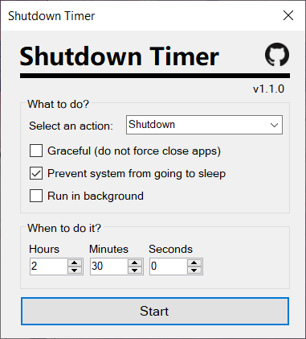
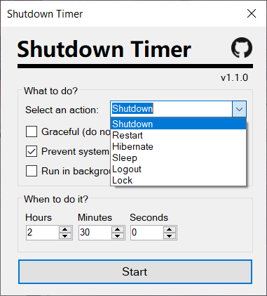
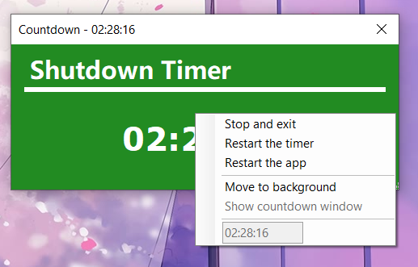
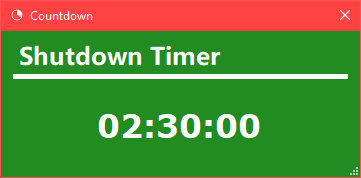
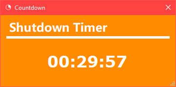
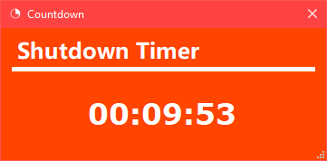
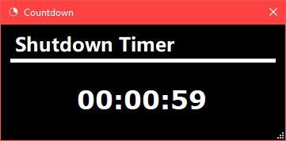
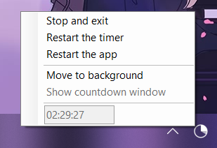

# Shutdown Timer Classic 🕒

Shutdown Timer Classic is a small little Windows application that allows you to set a timer that will shutdown, restart, hibernate, sleep or lock your PC.



I also have a UWP based version of this project in the works, but the development will take some time as the UWP platform brings some unforeseen hurdles with it and is a lot more complicated than I initially thought.
I will update this document and my website once the project is ready.

# Usage ✨

Shutdown Timer is a very simple application hence it is easy to use.
Just choose a power action from the drop-down menu and then dial in the time span you want. If the counter reaches zero the chosen power action will be executed.

Upon reaching zero, the Shutdown Timer will (actually Windows will do this, Shutdown Timer just gives the command to) force close any still running applications to ensure the shutdown does not get interrupted.
Therefore you may experience data loss if any application is in the process of saving or processing data when the shutdown begins.
You can combat this by selecting a longer timespan to ensure the running applications has enough headroom to complete its operation or by choosing the *Sleep* or *Hibernate* power actions.

If you are certain that all applications will exit properly and will not require any human interaction (like a word processor which would open a save dialog when being told to exit), you can choose a graceful shutdown which will just execute a regular shutdown as if you were to manually shutdown Windows yourself.
This means that all applications will have enough time to exit and nothing is forced to exit (which also means that applications can interrupt the shutdown).
Thus you should be careful to use this mode as it might result in a failed shutdown.
*The graceful mode applies to all power actions which force close apps and is not exclusive to a shutdown.*

By default, the countdown window will be always on top of every other window so you don't forget that you have an active shutdown timer. The countdown can also be hidden by selecting the "Run in background" checkbox under the dropdown menu. If the countdown is already running you can just right click anywhere in the countdown window to bring up a menu with the option to minimize the countdown to the background. It can also be brought back from the background by using the tray menu (described below).





# Colors 🎨

The countdown window has 4 different background colors to visualize the time left and one animation to draw your attention when the time is about to run out, in case you forget about the shutdown timer.
Here is a quick overview:

| Time left     | Color         | Animated  |
| ------------- | ------------- | --------- |
| > 30 min.     | Green         | No        |
| 30 - 10 min.  | Yellow        | No        |
| 10 - 1 min.   | Orange        | No        |
| < 1min.       | Red / Black   | Yes       |







# Tray Menu 🔧

Shutdown Timer also includes a tray menu to control the application from you Taskbar tray. Just right click the icon to bring it up (you may need to click on the little arrow on the right of your Taskbar to find the Shutdown Timer icon). You can stop, restart and view the timer from it and also switch the UI mode to hide or show the countdown window.



The same menu can also be accessed by right clicking in the countdown window.

# CLI 🐱‍💻

You can also use the command line to start the Shutdown Timer with specific arguments and settings.
In PowerShell or CMD navigate to the folder where the executable is located.

Then type `.\ShutdownTimerClassic.exe` and add the arguments you want after this:

```
Argument                 Description

/SetTime <time>          Sets the time for the countdown. Either type in the seconds, use HH:mm:ss or HH:mm.

/SetAction <action>      Sets the power action which will be executed after the countdown reached zero.
                         Type in the exact name as seen in the UI (eg: Shutdown, Restart or Sleep. Do not use shutdown Reboot or SLEEP)

/Graceful                Will use the graceful mode if available. This means that your computer will do a normal, interruptible, shutdown.
                         Your shutdown might fail when apps resist the close event. Only use this if you know what you are doing.

/AllowSleep              Allows your computer to go to sleep while the countdown is active.

/Background              Runs the countdown in the background.
                         This is not a silent mode, the user will still get notifications and can use the tray menu.

                         These control modes define how the application will behave once started with arguments. (Default: Recommend)
/Takeover                Overrides settings and starts the timer.
/Lock                    Overrides settings and locks UI controls but lets user control wether or not to start the timer.
/Recommend               Prepopulates settings but leaves the UI unlocked.
```

Example: `.\ShutdownTimerClassic.exe /SetTime 01:00 /SetAction Hibernate /Takeover`
This command will launch launch Shutdown Timer in hibernation mode with 1 hours, 0 minutes and 0 seconds and start the countdown.

Please note that the user will see a message explaining that the countdown has been started externally.

If you want to redistribute my executable with your own app/script you are free to do so. Please just keep it updated and mention this project somewhere in the description (ie: follow the license for this project).

# Behavior 📄

## Shutdown sequence

When a shutdown is executed all windows will be closed, regardless if they resist or not so any unsaved work will be gone! This is done to be sure your PC shuts down and can not be stopped by another process.

If you wish to have a normal shutdown you may enable the graceful mode. This will not force close any apps, but might lead to a failed shutdown as any apps which do not exit upon request can pause the shutdown. Apps might not close because they are unresponsive, require user interactions, or are still working. 

Please note that I am not liable for any data loss because you didn't save that extremely important document and now it's gone. That is your fault!

## Canceling the shutdown

As long as the timer has not reached zero, you can cancel the countdown at any time by simply pressing the close button (that big X in the top right corner). A dialog will then pop up asking you if you want to cancel. If you choose so, the countdown will be immediately canceled and another message will tell you that the countdown was successfully canceled and that the application will close after clicking OK. At this point, the countdown has already stopped and you have all the time you want before clicking ok, which results in the application closing itself.

If you are running it in the background, then you can go to the notification area (click on the arrow on the right side of your taskbar) and right-click on the application icon. This will bring up a menu with the option "Stop and exit". Clicking this will cancel the shutdown and tell you about the cancellation using a message box.

## Logging and Privacy

The application is not connected to the internet and does not log any user data when you are using the GitHub release. If you are using the Microsoft Store release, then the Store will monitor basic usage and crashes.
